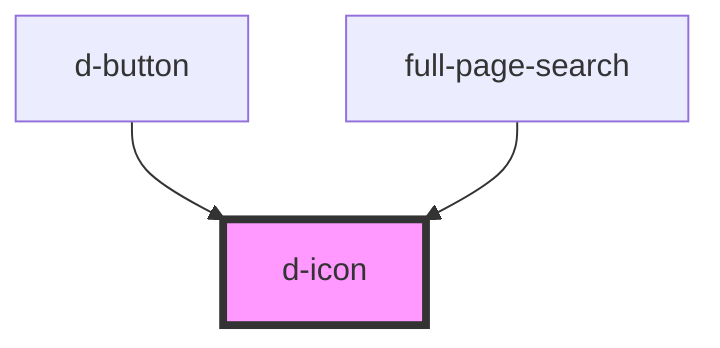

# d-icon

<!-- Auto Generated Below -->

## Properties

| Property      | Attribute       | Description               | Type                                                                                        | Default     |
| ------------- | --------------- | ------------------------- | ------------------------------------------------------------------------------------------- | ----------- |
| `color`       | `color`         | 图标颜色                      | `"danger" \| "default" \| "primary" \| "secondary" \| "success" \| "tertiary" \| "warning"` | `'default'` |
| `cssClass`    | `css-class`     | 自定义 CSS 类名                | `string`                                                                                    | `undefined` |
| `dAriaHidden` | `d-aria-hidden` | 是否隐藏图标（用于无障碍）             | `boolean`                                                                                   | `true`      |
| `flipH`       | `flip-h`        | 是否翻转图标（水平）                | `boolean`                                                                                   | `false`     |
| `flipV`       | `flip-v`        | 是否翻转图标（垂直）                | `boolean`                                                                                   | `false`     |
| `iconTitle`   | `icon-title`    | 图标标题（用于无障碍访问）             | `string`                                                                                    | `undefined` |
| `name`        | `name`          | 图标名称                      | `string`                                                                                    | `''`        |
| `rotate`      | `rotate`        | 旋转角度（90 的倍数：90, 180, 270） | `180 \| 270 \| 90`                                                                          | `undefined` |
| `size`        | `size`          | 图标尺寸                      | `"lg" \| "md" \| "sm" \| "xl"`                                                              | `'md'`      |
| `spin`        | `spin`          | 是否旋转图标                    | `boolean`                                                                                   | `false`     |

## Slots

| Slot | Description        |
| ---- | ------------------ |
|      | 图标内容（可选，用于自定义 SVG） |

## Dependencies

### Used by

 - [d-button](../d-button)
 - [full-page-search](../full-page-search)

### Graph

----------------------------------------------

*Built with [StencilJS](https://stenciljs.com/)*
