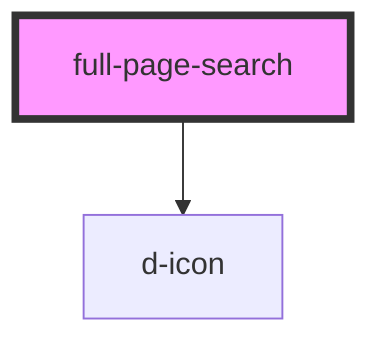

# full-page-search

<!-- Auto Generated Below -->

## Properties

| Property              | Attribute               | Description           | Type                                                                           | Default       |
| --------------------- | ----------------------- | --------------------- | ------------------------------------------------------------------------------ | ------------- |
| `categories`          | --                      | 分类结果                  | `SearchResult[]`                                                               | `[]`          |
| `currentPage`         | `current-page`          | 当前页码                  | `number`                                                                       | `1`           |
| `enableBulkSelect`    | `enable-bulk-select`    | 是否启用批量选择              | `boolean`                                                                      | `false`       |
| `error`               | `error`                 | 搜索错误信息                | `string`                                                                       | `null`        |
| `loadingMore`         | `loading-more`          | 是否正在加载更多              | `boolean`                                                                      | `false`       |
| `minLength`           | `min-length`            | 最小搜索长度                | `number`                                                                       | `3`           |
| `pageSize`            | `page-size`             | 每页数量                  | `number`                                                                       | `20`          |
| `results`             | --                      | 搜索结果                  | `SearchResult[]`                                                               | `[]`          |
| `searchApiUrl`        | `search-api-url`        | 自定义搜索 API 端点          | `string`                                                                       | `undefined`   |
| `searchContext`       | --                      | 搜索上下文（如分类 ID、标签 ID 等） | `{ type: "user" \| "tag" \| "category"; id: string \| number; name: string; }` | `undefined`   |
| `searchHeaders`       | --                      | 搜索请求头                 | `string`                                                                       | `undefined`   |
| `searchTerm`          | `search-term`           | 搜索关键词                 | `string`                                                                       | `''`          |
| `searchType`          | `search-type`           | 搜索类型                  | `"categories" \| "default" \| "posts" \| "tags" \| "topics" \| "users"`        | `'default'`   |
| `searching`           | `searching`             | 是否正在搜索                | `boolean`                                                                      | `false`       |
| `showAdvancedOptions` | `show-advanced-options` | 是否显示高级选项              | `boolean`                                                                      | `false`       |
| `showResultCount`     | `show-result-count`     | 是否显示结果计数              | `boolean`                                                                      | `true`        |
| `sortOrder`           | `sort-order`            | 排序方式                  | `"latest" \| "relevance" \| "top"`                                             | `'relevance'` |
| `tags`                | --                      | 标签结果                  | `SearchResult[]`                                                               | `[]`          |
| `totalResults`        | `total-results`         | 搜索结果总数                | `number`                                                                       | `0`           |
| `users`               | --                      | 用户结果                  | `SearchResult[]`                                                               | `[]`          |

## Events

| Event               | Description | Type                                               |
| ------------------- | ----------- | -------------------------------------------------- |
| `dBulkSelectChange` | 批量选择变化时触发   | `CustomEvent<{ selected: string[]; }>`             |
| `dLoadMore`         | 加载更多内容时触发   | `CustomEvent<{ page: number; }>`                   |
| `dResultsChange`    | 搜索结果变化时触发   | `CustomEvent<SearchResponse>`                      |
| `dSearchChange`     | 搜索变化时触发     | `CustomEvent<{ term: string; type: SearchType; }>` |

## Methods

### `clearSearch() => Promise<void>`

清除搜索

#### Returns

Type: `Promise<void>`

### `clearSelection() => Promise<void>`

取消全选

#### Returns

Type: `Promise<void>`

### `focusInput() => Promise<void>`

聚焦搜索输入框

#### Returns

Type: `Promise<void>`

### `loadMore() => Promise<void>`

加载下一页

#### Returns

Type: `Promise<void>`

### `performSearch(term: string) => Promise<void>`

设置搜索关键词并执行搜索

#### Parameters

| Name   | Type     | Description |
| ------ | -------- | ----------- |
| `term` | `string` |             |

#### Returns

Type: `Promise<void>`

### `selectAll() => Promise<void>`

全选当前页结果

#### Returns

Type: `Promise<void>`

### `toggleBulkSelect() => Promise<void>`

切换批量选择模式

#### Returns

Type: `Promise<void>`

### `toggleSelect(id: string) => Promise<void>`

选择/取消选择结果

#### Parameters

| Name | Type     | Description |
| ---- | -------- | ----------- |
| `id` | `string` |             |

#### Returns

Type: `Promise<void>`

## Slots

| Slot               | Description |
| ------------------ | ----------- |
| `"loading"`        | 加载状态显示的内容   |
| `"no-results"`     | 无结果时显示的内容   |
| `"search-input"`   | 搜索输入框区域     |
| `"search-options"` | 高级搜索选项      |
| `"search-results"` | 搜索结果区域      |

## Dependencies

### Depends on

- [d-icon](../d-icon)

### Graph

----------------------------------------------

*Built with [StencilJS](https://stenciljs.com/)*
